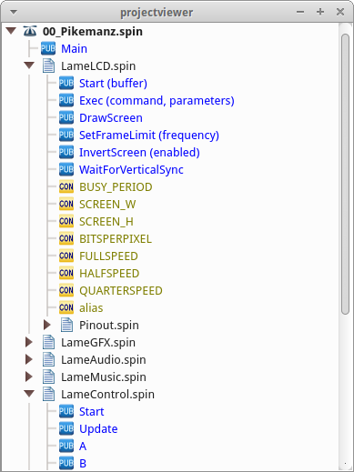
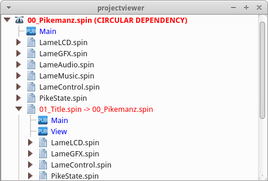
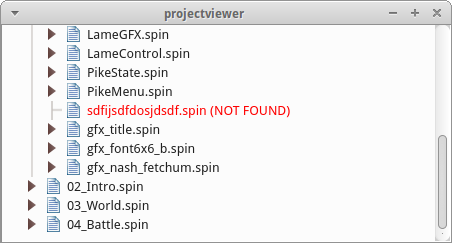

# projectviewer

projectviewer shows a dynamic bird's eye view of your project, and can be customized to your language and application.

Here, projectviewer is showing a Spin language project.



projectviewer notifies the user when there is a circular dependency in inclusion.



It will also tell you when a file was not found.



## Usage

### Setup

```cpp
Parser parser;
parser.setCaseInsensitive(true);
```

### Setting up search paths

To use projectviewer, you need to provide a filename and
additional search paths for locating local dependencies.

```cpp
parser.setFile("../../Pikemanz/00_Pikemanz.spin");
parser.setLibraryPaths(QStringList() << "../../../");
```

### Rules

To use projectviewer, you must build a description of the
language elements you'd like to to display. This is done using the
`Parser::Rule` structure,

A special Rule is defined for declaring file dependencies: `_includes_`.
Using this variable will result in projectviewer looking in the file system
for the string you extract from the source file.

Each rule can hold multiple patterns for languages that support multiple
variations of a syntax with the same meaning.

Rules are created by passing a list of patterns to the `addRule` function,
so let's create a list of patterns.
So let's create a rule.

```cpp
QList<Parser::Pattern> patterns;
```

### Adding patterns

A Rule contains a list of `Parser::Pattern` structures. To start,
we create a Pattern.

```cpp
Parser::Pattern pattern;
```

Each `Pattern` contains a regular expression and a list
of values that describe how to extract the string.

To extract any data at all, your regular expression must contain
unnamed pattern groups to extract.

```cpp
pattern.regex = "^[ \t]*([a-zA-Z_]+[a-zA-Z0-9_]*)[ \t]*=[ \t]*(.+?)('.*?)?[ \t]*$";
```

`capture` is a `QList<QVariant` object that can hold either `int` or
`QString`. If an int, it will capture a group from the regular expression. If
a QString, the string will be added to the result.

```cpp
pattern.capture << 1 << " returns " << 2;
```

Now add the pattern to the list.

```cpp
patterns.append(pattern);
```

### Adding the rule

Provide a name, icon, and color for display.

```cpp
parser.addRule("constants",patterns,
    QIcon(":/icons/projectviewer/block-pub.png"),
    QColor("#0000FF"));
```

### Displaying the tree

```cpp
parser.buildModel();
```
Now use the `getModel()` function to display your project with a 
`QTreeView`.

```cpp
QTreeView *tree= new QTreeView();
tree->setModel(parser.getModel());
tree->show();
```
